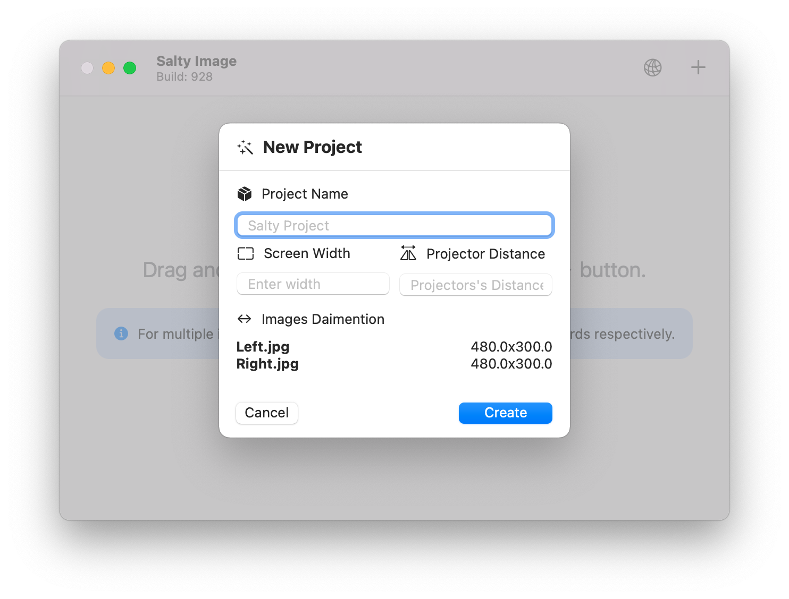
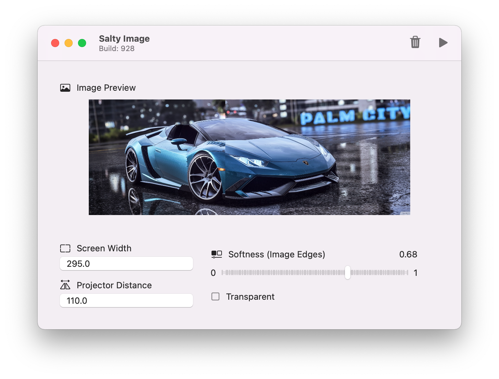
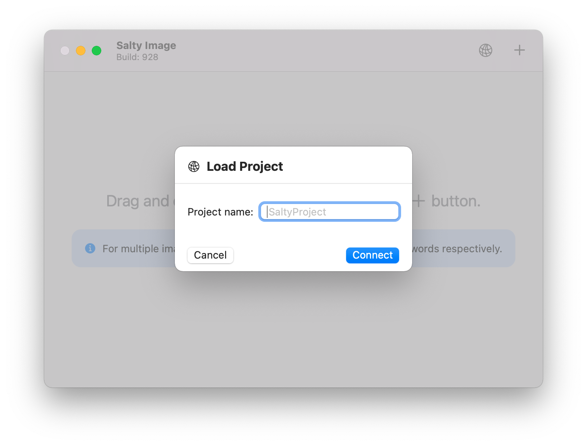
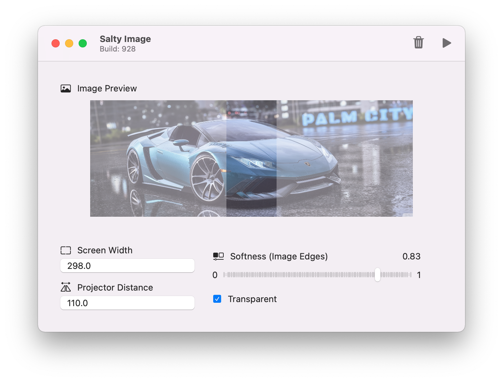

# Salty Image

Salty Image is a macOS application that uses PythonKit and Python's OpenCV package to perform image processing on two images that can be displayed using two projectors which results in a wide screen.

## Getting Started

These instructions will get you a copy of the project up and running on your local machine.

- From the [Releases](https://github.com/iarata/salty-image/releases) section download the latest version and open the .dmg file.
- Right click on the `Salty Image.app` and click open.

| Initial Views | Loaded Views |
| ------------- | ------------- |
|   |   |
|   |   |

### Prerequisites

- Required OS: macOS 11.4 (BigSur) or higher
- Python v3.8
- Python Packages: openCV, numpy

### How to use

For using this application you need to cut your image that you want to display into two images that have overlapping areas (for examples see the `Left.png` and `Right.png` in the [Images](https://github.com/iarata/salty-image/tree/main/Images) folder).

Then drag & drop the images to the application or click the + button to add them, then specify the details and click `Create`.
You can also load a project from Firebase by clicking the earth icon and specifying the project name.

When images are loaded, you can change the specified projector details and see a preview of overlapping areas by checking the transparent checkbox. Following that you can click the start icon to start the application. The output files will be stored in the `Downloads` folder.

## Built with

- [Swift 5.5](https://developer.apple.com/swift/), [SwiftUI](https://developer.apple.com/xcode/swiftui/) & [Python](https://python.org) - The programming language used

## Authors

- **Hajebrahimi Alireza** - [iarata](https://github.com/iarata)
- **Rohiniesh Neti** - [Wiserohin](https://github.com/Wiserohin)

See also the list of [contributors](https://github.com/iarata/salty-image/contributors) who participated in this project.

Send me an email at mrex778@yahoo.ca if you would like to contribute :)

## License

This project is licensed under the BSD 3-Clause "New" or "Revised" License - see the LICENSE file for details
